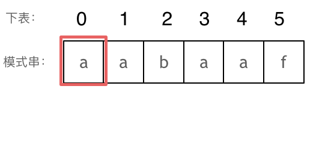

## KMP算法

### 前缀表

写过KMP的同学，一定都写过next数组，那么这个next数组究竟是个啥呢？

next数组就是一个前缀表（prefix table）。

前缀表有什么作用呢？

**前缀表是用来回退的，它记录了模式串与主串(文本串)不匹配的时候，模式串应该从哪里开始重新匹配。**

为了清楚地了解前缀表的来历，我们来举一个例子：

要在文本串：aabaabaafa 中查找是否出现过一个模式串：aabaaf。

但如果使用前缀表，就不会从头匹配，而是从上次已经匹配的内容开始匹配，找到了模式串中第三个字符b继续开始匹配。

此时就要问了**前缀表是如何记录的呢？**

首先要知道前缀表的任务是当前位置匹配失败，找到之前已经匹配上的位置，再重新匹配，此也意味着在某个字符失配时，前缀表会告诉你下一步匹配中，模式串应该跳到哪个位置。

那么什么是前缀表：**记录下标i之前（包括i）的字符串中，有多大长度的相同前缀后缀。**

**前缀是指不包含最后一个字符的所有以第一个字符开头的连续子串**。

**后缀是指不包含第一个字符的所有以最后一个字符结尾的连续子串**

**因为前缀表要求的就是相同前后缀的长度。**

而最长公共前后缀里面的“公共”，更像是说前缀和后缀公共的长度。这其实并不是前缀表所需要的。

所以字符串a的最长相等前后缀为0。 字符串aa的最长相等前后缀为1。 字符串aaa的最长相等前后缀为2。 等等.....。

这就是前缀表，那为啥就能告诉我们 上次匹配的位置，并跳过去呢？

回顾一下，刚刚匹配的过程在下标5的地方遇到不匹配，模式串是指向f，如图： 


然后就找到了下标2，指向b，继续匹配：如图： 


### 如何计算前缀表

接下来就要说一说怎么计算前缀表。

如图：



长度为前1个字符的子串`a`，最长相同前后缀的长度为0。（注意字符串的**前缀是指不包含最后一个字符的所有以第一个字符开头的连续子串**；**后缀是指不包含第一个字符的所有以最后一个字符结尾的连续子串**。）


长度为前2个字符的子串`aa`，最长相同前后缀的长度为1。


长度为前3个字符的子串`aab`，最长相同前后缀的长度为0。

以此类推： 长度为前4个字符的子串`aaba`，最长相同前后缀的长度为1。 长度为前5个字符的子串`aabaa`，最长相同前后缀的长度为2。 长度为前6个字符的子串`aabaaf`，最长相同前后缀的长度为0。

那么把求得的最长相同前后缀的长度就是对应前缀表的元素，如图： 


可以看出模式串与前缀表对应位置的数字表示的就是：**下标i之前（包括i）的字符串中，有多大长度的相同前缀后缀。**

再来看一下如何利用 前缀表找到 当字符不匹配的时候应该指针应该移动的位置。如动画所示：


找到的不匹配的位置， 那么此时我们要看它的前一个字符的前缀表的数值是多少。

为什么要前一个字符的前缀表的数值呢，因为要找前面字符串的最长相同的前缀和后缀。

所以要看前一位的 前缀表的数值。

前一个字符的前缀表的数值是2， 所以把下标移动到下标2的位置继续比配。 可以再反复看一下上面的动画。

最后就在文本串中找到了和模式串匹配的子串了。

### 使用next数组来匹配

**以下我们以前缀表统一减一之后的next数组来做演示**。

有了next数组，就可以根据next数组来 匹配文本串s，和模式串t了。

注意next数组是新前缀表（旧前缀表统一减一了）。

匹配过程动画如下：


### 构造next数组

我们定义一个函数getNext来构建next数组，函数参数为指向next数组的指针，和一个字符串。 代码如下：

```c++
void getNext(int* next, const string& s)
```

**构造next数组其实就是计算模式串s，前缀表的过程。** 主要有如下三步：

1. 初始化
2. 处理前后缀不相同的情况
3. 处理前后缀相同的情况

接下来我们详解一下。

1. 初始化：

定义两个指针i和j，j指向前缀末尾位置，i指向后缀末尾位置。

然后还要对next数组进行初始化赋值，如下：

```cpp
int j = -1;
next[0] = j;
```

j 为什么要初始化为 -1呢，因为之前说过 前缀表要统一减一的操作仅仅是其中的一种实现，我们这里选择j初始化为-1，下文我还会给出j不初始化为-1的实现代码。

next[i] 表示 i（包括i）之前最长相等的前后缀长度（其实就是j）

所以初始化next[0] = j 。

1. 处理前后缀不相同的情况

因为j初始化为-1，那么i就从1开始，进行s[i] 与 s[j+1]的比较。

所以遍历模式串s的循环下标i 要从 1开始，代码如下：

```cpp
for (int i = 1; i < s.size(); i++) {
```

如果 s[i] 与 s[j+1]不相同，也就是遇到 前后缀末尾不相同的情况，就要向前回退。

怎么回退呢？

next[j]就是记录着j（包括j）之前的子串的相同前后缀的长度。

那么 s[i] 与 s[j+1] 不相同，就要找 j+1前一个元素在next数组里的值（就是next[j]）。

所以，处理前后缀不相同的情况代码如下：

```cpp
while (j >= 0 && s[i] != s[j + 1]) { // 前后缀不相同了
    j = next[j]; // 向前回退
}
```

1. 处理前后缀相同的情况

如果 s[i] 与 s[j + 1] 相同，那么就同时向后移动i 和j 说明找到了相同的前后缀，同时还要将j（前缀的长度）赋给next[i], 因为next[i]要记录相同前后缀的长度。

代码如下：

```c++
if (s[i] == s[j + 1]) { // 找到相同的前后缀
    j++;
}
next[i] = j;
```

最后整体构建next数组的函数代码如下：

```cpp
void getNext(int* next, const string& s){
    int j = -1;
    next[0] = j;
    for(int i = 1; i < s.size(); i++) { // 注意i从1开始
        while (j >= 0 && s[i] != s[j + 1]) { // 前后缀不相同了
            j = next[j]; // 向前回退
        }
        if (s[i] == s[j + 1]) { // 找到相同的前后缀
            j++;
        }
        next[i] = j; // 将j（前缀的长度）赋给next[i]
    }
}
```

代码构造next数组的逻辑流程动画如下：


得到了next数组之后，就要用这个来做匹配了。

### 使用next数组来做匹配

在文本串s里 找是否出现过模式串t。

定义两个下标j 指向模式串起始位置，i指向文本串起始位置。

那么j初始值依然为-1，为什么呢？ **依然因为next数组里记录的起始位置为-1。**

i就从0开始，遍历文本串，代码如下：

```cpp
for (int i = 0; i < s.size(); i++) 
```

接下来就是 s[i] 与 t[j + 1] （因为j从-1开始的） 进行比较。

如果 s[i] 与 t[j + 1] 不相同，j就要从next数组里寻找下一个匹配的位置。

代码如下：

```cpp
while(j >= 0 && s[i] != t[j + 1]) {
    j = next[j];
}
```

如果 s[i] 与 t[j + 1] 相同，那么i 和 j 同时向后移动， 代码如下：

```cpp
if (s[i] == t[j + 1]) {
    j++; // i的增加在for循环里
}
```

如何判断在文本串s里出现了模式串t呢，如果j指向了模式串t的末尾，那么就说明模式串t完全匹配文本串s里的某个子串了。

本题要在文本串字符串中找出模式串出现的第一个位置 (从0开始)，所以返回当前在文本串匹配模式串的位置i 减去 模式串的长度，就是文本串字符串中出现模式串的第一个位置。

代码如下：

```cpp
if (j == (t.size() - 1) ) {
    return (i - t.size() + 1);
}
```

那么使用next数组，用模式串匹配文本串的整体代码如下：

```cpp
int j = -1; // 因为next数组里记录的起始位置为-1
for (int i = 0; i < s.size(); i++) { // 注意i就从0开始
    while(j >= 0 && s[i] != t[j + 1]) { // 不匹配
        j = next[j]; // j 寻找之前匹配的位置
    }
    if (s[i] == t[j + 1]) { // 匹配，j和i同时向后移动
        j++; // i的增加在for循环里
    }
    if (j == (t.size() - 1) ) { // 文本串s里出现了模式串t
        return (i - t.size() + 1);
    }
}
```

此时所有逻辑的代码都已经写出来了，力扣 28.实现strStr 题目的整体代码如下：

### 前缀表统一减一 C++代码实现

```cpp
class Solution {
public:
    void getNext(int* next, const string& s) {
        int j = -1;
        next[0] = j;
        for(int i = 1; i < s.size(); i++) { // 注意i从1开始
            while (j >= 0 && s[i] != s[j + 1]) { // 前后缀不相同了
                j = next[j]; // 向前回退
            }
            if (s[i] == s[j + 1]) { // 找到相同的前后缀
                j++;
            }
            next[i] = j; // 将j（前缀的长度）赋给next[i]
        }
    }
    int strStr(string haystack, string needle) {
        if (needle.size() == 0) {
            return 0;
        }
		vector<int> next(needle.size());
		getNext(&next[0], needle);
        int j = -1; // // 因为next数组里记录的起始位置为-1
        for (int i = 0; i < haystack.size(); i++) { // 注意i就从0开始
            while(j >= 0 && haystack[i] != needle[j + 1]) { // 不匹配
                j = next[j]; // j 寻找之前匹配的位置
            }
            if (haystack[i] == needle[j + 1]) { // 匹配，j和i同时向后移动
                j++; // i的增加在for循环里
            }
            if (j == (needle.size() - 1) ) { // 文本串s里出现了模式串t
                return (i - needle.size() + 1);
            }
        }
        return -1;
    }
};
```

- 时间复杂度: O(n + m)
- 空间复杂度: O(m), 只需要保存字符串needle的前缀表

### 前缀表（不减一）C++实现

那么前缀表就不减一了，也不右移的，到底行不行呢？

**行！**

我之前说过，这仅仅是KMP算法实现上的问题，如果就直接使用前缀表可以换一种回退方式，找j=next[j-1] 来进行回退。

主要就是j=next[x]这一步最为关键！

我给出的getNext的实现为：（前缀表统一减一）

```cpp
void getNext(int* next, const string& s) {
    int j = -1;
    next[0] = j;
    for(int i = 1; i < s.size(); i++) { // 注意i从1开始
        while (j >= 0 && s[i] != s[j + 1]) { // 前后缀不相同了
            j = next[j]; // 向前回退
        }
        if (s[i] == s[j + 1]) { // 找到相同的前后缀
            j++;
        }
        next[i] = j; // 将j（前缀的长度）赋给next[i]
    }
}
```

此时如果输入的模式串为aabaaf，对应的next为-1 0 -1 0 1 -1。

这里j和next[0]初始化为-1，整个next数组是以 前缀表减一之后的效果来构建的。

那么前缀表不减一来构建next数组，代码如下：

```cpp
    void getNext(int* next, const string& s) {
        int j = 0;
        next[0] = 0;
        for(int i = 1; i < s.size(); i++) {
            while (j > 0 && s[i] != s[j]) { // j要保证大于0，因为下面有取j-1作为数组下标的操作
                j = next[j - 1]; // 注意这里，是要找前一位的对应的回退位置了
            }
            if (s[i] == s[j]) {
                j++;
            }
            next[i] = j;
        }
    }
```

此时如果输入的模式串为aabaaf，对应的next为 0 1 0 1 2 0，（其实这就是前缀表的数值了）。

那么用这样的next数组也可以用来做匹配，代码要有所改动。

实现代码如下：

```cpp
class Solution {
public:
    void getNext(int* next, const string& s) {
        int j = 0;
        next[0] = 0;
        for(int i = 1; i < s.size(); i++) {
            while (j > 0 && s[i] != s[j]) {
                j = next[j - 1];
            }
            if (s[i] == s[j]) {
                j++;
            }
            next[i] = j;
        }
    }
    int strStr(string haystack, string needle) {
        if (needle.size() == 0) {
            return 0;
        }
        vector<int> next(needle.size());
        getNext(&next[0], needle);
        int j = 0;
        for (int i = 0; i < haystack.size(); i++) {
            while(j > 0 && haystack[i] != needle[j]) {
                j = next[j - 1];
            }
            if (haystack[i] == needle[j]) {
                j++;
            }
            if (j == needle.size() ) {
                return (i - needle.size() + 1);
            }
        }
        return -1;
    }
};
```

- 时间复杂度: O(n + m)
- 空间复杂度: O(m)