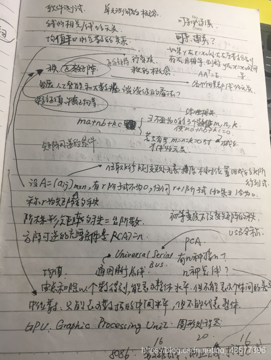
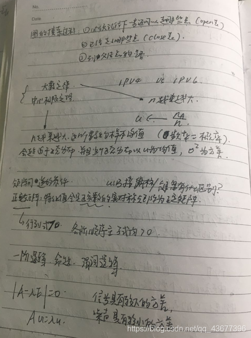
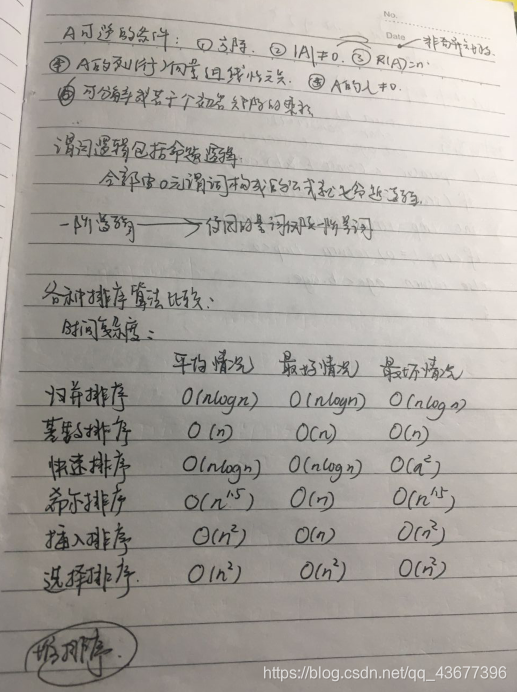
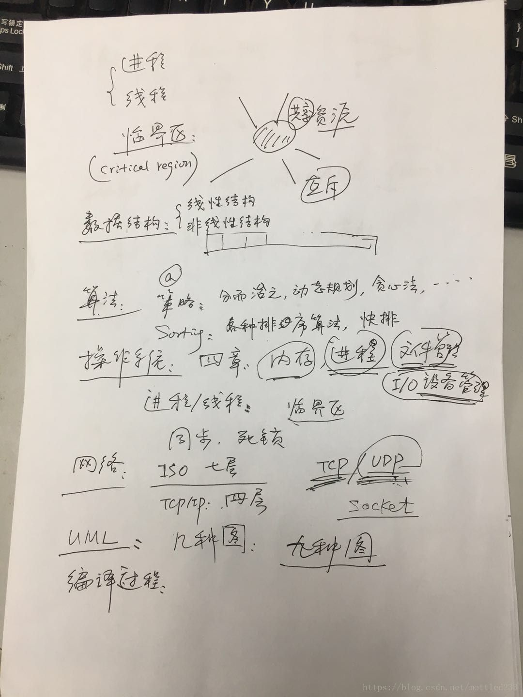

# 人大

## [1](https://blog.csdn.net/weixin_41499217/article/details/108732859)

论文阅读

老师会给你列出几个研究方向让你选择  然后提供你一篇论文 （我的是中文的 人大的导师的论文）在你正式开始面试前十几分钟，来阅读这篇论文，面试正式开始将不允许再打开，开始面试的第一个问题是“论文主要研究的是什么？用的什么方法？解决了什么问题？”

专业知识

接着是抽签选择你的问题

我的问题：

1、什么是“用户画像”？一般用来作什么 ？

2、一个关于信息安全的知识  信息安全当时没怎么复习 没答上 所以问题我也记不太清了 好像是用户隐私什么的

3、什么是堆，什么时候用到堆？

4.一个开放性问题：给你微博的数据，你想做哪些研究？

还问了 学校专业课都学了哪些学科  喜欢哪个方向 有过专门学习或者项目经验吗

英语

就问了一个：团队协作时候遇到问题 你们是怎么解决的

## [2](https://zhuanlan.zhihu.com/p/569173073)

入营后分为机试和面试，机试可以用CSP抵，这里我果断选用CSP抵机试（因为CSP270，换算成机试分还不错），最后顺利进入面试

面试：英文自我介绍+项目（项目轰炸我接近10分钟，各角度提问，所幸都在准备范围内，顺利通过）

接下来是出意外的地方，由于信院数据库很强，他面试疯狂问，我数据库是完全没复习。。。几个问题可以说是耗尽了前面老师的好感，如果有好好复习数据库的话大概率能直拿优营，我被问到：

1.事务ACID特性及如何保持（这个会，原子性（提交和回滚保持），持久性（数据库备份和恢复），隔离性（加锁保持），一致性（前三个得到保证这个就能基本保证）

2.锁有几种？分别应用于什么场景（这个会）

3.用没用过视图，介绍一下（早忘了。。）

4.1NF,2NF,3NF,BCNF,4NF的关系和区别（还记得一点，但又不完全记得。。。）

5.B+树原理及其两个入口（这个会）

6.数据库密钥/隐私保护 （啥呀。。。完全不会）

7.展示一段数据库英文论文，英文提问（炸穿。。。）

## [3](https://www.cnblogs.com/LilyZhang007/p/15035674.html)

笔试：三道手写程序，可以用csp成绩抵。因为期末考试＋之前说过的我啥也没复习，我就用我大二考的csp抵了（很搞笑，当时考的时候刚开始学数据结构，所以才210分，大无语），这样换算过来笔试成绩是85.5，完全没优势，可能也是在wl的主要原因吧哈哈，所以能参加笔试还是尽量参加一下的，比如我硬着头皮参加了高瓴的笔试（因为csp分太低没法抵…），好像结果还不错哈哈

面试：6-7个老师，7min左右，进去会先问英语问题，都比较基础，但是人大信院是我第一个面试的学院，当时啥也没准备，英语模板也没背，以至于很套路的题也回答的磕磕绊绊的……问完英语问题之后需要从1-10选一组题，我选择自己的幸运数字哈哈，感觉还行！但是计网没咋复习，问的问题没答上来，老师也很nice，又换了一个问题问我

> 英语问题：介绍一下你的本科学校、你收获最大的一个项目
> 专业问题：malloc底层实现用的数据结构、从函数依赖角度解释数据库范式、万兆网和10Mbps哪一个带宽大、Mac地址和网络层地址的区别和联系

## [4](https://blog.csdn.net/bxg1065283526/article/details/81214286)

面试：

我报考的是直博，英语面试和综合面试是一批老师，硕士有部分是分开面试。英语面试最重要的还是自我介绍，自我介绍不要说废话，我就是犯了这个毛病，因为时间紧张，我刚说完自己的基本情况，就被打断，老师让我说一下项目和课程情况，所以基本情况过后，一定要准备一下自己的项目和课程的一些情况。除此之外可以准备一下家乡、学校的英语介绍，以防万一。

接下来，中文内容需要详细说一下自己的项目或者论文，尽量让自己掌握主动权，多说但是不要说废话，说自己的工作和收获，一定不要夸大，可能会被怼，一旦被怼就应该会凉。我遇到的还有专业问题，最最最最最重要的莫过于数据结构，数据结构一定要多复习几遍，对于重要的内容，一定要上手实现，这样也有助于机试。我被问到的是DFS、BFS的伪码实现。DFS是递归实现，BFS需要借助于队列实现。

笔试：

笔试考的是编程语言，切记一定要将C、C++、JAVA看一遍，特别是三者有一些共有的问题。因为程序设计笔试占80分，所以一定要重视笔试，这直接决定了你会不会录取。

前面两道题是问答题，主要是编程语言的内容：

1. static在C、C++、java内的使用场景和作用。

2. 多态性在C++、Java内都有哪些体现，两种语言任选一种作答。


后面两道题是编程题，手写代码。

1. 完全平方数 输出所有四位数，是某一个数的完全平方数，并且格式为aabb，前两位相等，后两位相等。

2. 题目大意是给你一个文件的路径，该文件内是一篇英语文章，你需要读出该文件内的词频最高的前K个单词，具体要求有很多，比如不能使用STL（笔试题均不能使用STL），我记得有好多要求，但是我想不起来了，抱歉，最后还需要分析你的代码的时空复杂度。知道前K个单词后，若你知道单词在每个段落的分布，你该如何向读者推荐哪个段落。


总结来看，考察的是C语言的文件操作（这个考点连续考了两年，务必重视），字符串的操作，复杂度分析。

机试：
机试招生简章上说的只能用C语言，但是考试的时候并没有强调这一点，大家视自己的情况，最好是多多练习C语言，我可以肯定的是，学校肯定会检查你的代码，特别是你没有通过。

两道题，时间为一个小时，时间较为紧迫，其中还包括你在系统的注册账号时间，系统使用的是北大的openjudge，可以提前去熟悉一下系统，考试时可以使用的编译器是VS2010和DEV-C++。整体来说人大的机试题不难，并且比重只占20分，但是时间有些紧张，我们这一届，参加计算机机试的有100左右，只有3个人两道题全部AC，第一题AC的人为13人，第二题Ac为9人，不过我觉得大家应该是时间不太够，不过学校事后会检查代码，机试你AC不了，也一定要将自己的代码提交一下。

1.提供了48个数据，格式为 2018.06.23 Russia-England ，输入的为一个国家的名字，输入所有该国家的比赛时间及对手，我认为这个题主要是数据的处理，十分耽误时间，其实考察的就是简单的字符串比较。

2.输入一个二位数组，内容是。# *，输出一共有多少个*组成的邻居团体以及最大的一个邻居团体有多少个*（*的相邻的8个位置都算是他的邻居），格式大概如下

######*##*

###*##****#

####***#**#

#****##***#

考察也就是DFS或者BFS算法。

## [5](https://blog.csdn.net/qq_41427568/article/details/107571658?utm_medium=distribute.pc_relevant.none-task-blog-2~default~BlogCommendFromMachineLearnPai2~default-17.control&depth_1-utm_source=distribute.pc_relevant.none-task-blog-2~default~BlogCommendFromMachineLearnPai2~default-17.control)

其实在入营之前，我看了下面这个经验贴：[2019年人大信院经验贴](https://zhuanlan.zhihu.com/p/105862892)，19年人大信院夏令营又是机试、笔试，又是多轮面试，弄得我很紧张，但是因为今年线上举行的原因，考核形式完全变了模样，如果明年恢复线下夏令营的话，我比较建议想去人大的同学认真看看上面19年的经验贴。

考核形式：读paper+面试

读paper环节：在进入面试前20分钟，等候室的老师会让你选一个方向，然后发给你这个方向的一篇论文（随机发的），在面试开始前这20分钟需要读懂这篇论文的背景挑战和解决方法，不能借助翻译和其他工具。我选的方向是多媒体方向，被分到的论文是多模态相关的一个工作，一共16页，因为我之前读过一些多模态方向的论文，所以对我来讲不是很难，我还是比较快的就看完了文章的重要部分（摘要+面临的挑战+网络结构+优化模型使用的tricks+损失函数等）。

面试：开始一分钟阐述论文的背景挑战和解决方法，接下来是抽信封答题，不同信封中的题不同，然后是英文回答问题，我被问到的问题是“请用英文阐述一个你做过的项目”，然后就是各个老师问问题环节，有问数据库的，有问数据结构的。当然，因为我报名的是博士，所以少不了问我“你为什么想读博？”，每个人读博动力都不一样，表明自己的态度就行。

夏令营感受

面试结束我感到无比的轻松，可能是因为这次的表现比南大要好吧，虽然也有不会的问题，但是我都（理直气壮的）承认了我的不足。时长大概是15-20分钟，面试老师很和蔼，面试气氛十分不错，正是因为如此，我对人大的好感度爆棚。

# 北航

## [1](https://blog.csdn.net/qq_43280818/article/details/123450451)

政治问题（10 个题抽一个回答）

英文自我介绍（感觉老师没咋听）

解释什么是边缘概率密度？什么是大数定律

你认为，这些知识 (刚才问的那些数学) 在你的项目中有什么作用

用 bert 干了什么

操作系统中的页表是干啥用的

一个编译好的程序的地址是什么地址

编译好的程序到内存运行时，生成地址经过了几次转换

ip 到 mac 地址是怎么转换的

arp 请求 和 响应报文有什么区别

问了一个天池竞赛是干什么的，自己参加的吗

vue 前端的一个问题，v-if 和 v-show 的区别

## [2](https://zhuanlan.zhihu.com/p/569173073)

面试硬核：英文自我介绍，政治题，数学（很大比例，包括线代，概率论，高数），专业课，项目

概率论：介绍大数定律（样本足够大时，样本均值以概率收敛于数学期望），中心极限定理（大量独立同分布的样本均值近似服从一维正态分布）

线代：正交矩阵，线性相关和线性无关定义

高数：二元函数连续，可微，可导，可积的关系

专业课：因人而异

## [3]([保研推免经历经验分享——2018北大软微、北航计算机、南大计算机夏令营保研经历_北大软件与微电子学院夏令营与北航计算机学院夏令营录取率-CSDN博客](https://blog.csdn.net/roujianglian7209/article/details/81875896))

北航夏令营是7月13日-7月15日，13日早上报到，上午是宣讲，这个时候可以提交自己的CSP成绩，用来免下午的机试，根据CSP成绩和实际机试的情况综合进行折分。比如参加机试且通过的人有100人，提交CSP的300人，你CSP成绩在所有提交的人中排名150名，那么你最后的分数和机试排名为50名的同学是一样的。但是提交CSP成绩的同学机试这一关是不会被淘汰的。提交了的同学下午就没事了，13日晚上出面试名单的具体分组和时间，14、15日两天面试，但具体到每个人也就20分钟，面试完就没什么事了。15日晚上出优秀营员名单。2017年的时候，北航是120左右的正式名单和60左右的递补名单，结果9月推免的时候都没招满（全放鸽子了）。估计18年北航也学聪明了，干脆180个正式，没有递补。16日的时候优秀营员可以在北航校医院体检，选择心仪导师并让其签字（双向选择），然后就全部结束了，当然也可以9月体检选导师。下面是我的面试情况。进去之后有5个老师，一个老师负责计时，一个老师在记录什么，三个老师主要提问，全程录像。A老师说自我介绍一下，我说用英文还是中文，老师说随便。我心里想，如果我现在用英文自我介绍，那英文环节不久可以省去吗？否则英文部分的面试太长了，不符合常理。我正准备要背诵我提前准备好的英文介绍，老师说1分钟。我立刻就慌了，然后我开始背，等我感觉1分钟的时候我就不背了，当时我正好背到和项目相关的地方，老师就用英文提问我！我听懂了老师问的，我也清楚地记得中文答案是啥，但是我不会用英文说啊，我结结巴巴近乎于全程发出“额…额…”，然后老师耐心地提示我，我真的崩溃了，就这样过去了1-2分钟这个环节勉强结束了。我本以为再也没有英语了，谁知，老师让我在一堆题里抽一个朗读并且翻译，索性我抽到一个比较简单的题，没有遇到什么生词，勉勉强强翻译完了，个人感觉应该过关了。然后老师又让我抽了一个思想政治题，题目是“你如何看待专业水平和思想道德的关系”，比较简单，就正常答，这种题答得好没什么影响，但是答得差会一票否决。接着B老师问了我简历里关于项目的一个问题，然后围绕这个又问了几个问题，C老师又让我介绍一下这个项目中的一个算法，幸好我早就准备了。然后B老师问了我一个概率论的问题，数学期望和方差，本来以为稳了，可谁知老师对我的回答不满意，说我答的和他问的不是一个问题，我很纳闷，可能我是真的理解错了老师的问题，最后，整个面试现场因为这个热闹了起来，每个老师脸上露出了难得的笑容，D老师说你要学以致用啊，顿时我就觉得凉了。最后A老师问我，编译系统的组成是什么，你们做过相关的课设吗？简要介绍一下。说一下上下文无关文法的特点。我都回答上来了，A老师说你可以走了。整个面试持续了20分钟，听说几乎每个人都是接近20分钟，但不会超过。最终的结果是我在录取名单上，但是排名在120-180之间，好在今年把正式和递补合在一起了，不然我就凉了。16日上午体检完，我就开始到处找老师，中间的过程真可谓艰辛，如戏剧一般，好在最后签了一个搞人工智能的教授，还算令人满意。我的总结是，能用CSP抵机试成绩的尽量用，有条件的早点把CSP考得高一些；录取之后的排名没有什么用，多数老师还会再单独面一次，部分老师非常抢手，可以尽早联系。另外必须要说的是，提早找住的地方，北航是不提供食宿的。

## [4]([2020计算机保研经验贴！（北航、北邮、中科院） - 知乎 (zhihu.com)](https://zhuanlan.zhihu.com/p/112129600))

1）北航软院

北航是一个老牌985，在5、6月还来过西安某酒店宣讲，规模还挺大的。我在宣讲会上递交简历与成绩单，加上了老师的微信，并成功拿到了北航软件学院的面试资格，等待7月去面试。北航软院是没有夏令营的，全靠自己联系老师！

2）北航计算机院

再然后是申请北航计院夏令营。北航偏爱西电的学生，500多营员里有56个西电学生，为比例最大。基本上有我这个排名都能入营。

北航的考核分为两轮，机考与面试，在两天。第一天上午提交CCF-CSP成绩然后听宣讲，建议300分以上的同学提交，可以免机考。第一天下午分两轮进行机考。由于各学校的夏令营是冲突的，所以有部分同学没来参加北航夏令营。大概四五百多人参加机考，当天晚上出第一轮结果。300人进第二轮。

第二轮是采取的群面模式，分为好多个面试教室。你被分配到某一个教室进行面试，大概5个老师看着你的简历轮流问你问题。这个面试又有点看运气，看面试你的老师做什么方向的。有的教室只问数学问题（离散、概率论、线代），有的教室问简历上的科研、项目问题，还有的教室问智商问题。第二轮300选180发优秀营员offer，也是当晚在北航计算机院官网通知。

第三天是优秀营员选老师的时候了，早上去某个教室排队领优营证明，要求当天上午找到接收你的老师。这个时候就体现出提前联系老师的好处了，有些同学在入营之前没有联系老师，拿到优营之后像无头苍蝇（说的就是我了，只好一个一个敲门找老师。不过没找到老师也不要慌张，可以交空白的优营证明，等到9月再找老师也是可以的！

最后西电过了18个优营，也算是很不错的，为自己的学校自豪！

## [5](https://blog.csdn.net/Dream_Glow/article/details/127073483)

机试+面试，机试可以用 csp 成绩抵，我的 csp 是大一考的，感觉抵了也不占优势，硬着头皮参加了机试。第一道是字符串大模拟，感觉分是拿全了，第二道根本没看。面试感觉很正规，北航老师真就人均移动题库，问了这些：

- 科技兴国

- 英文自我介绍
- 高斯分布、泊松分布
- 线性无关，矩阵的秩和迹
- 操作系统的功能和开机过程
- 计组课设介绍和指令，同步复位和异步复位
- 瀑布模型和螺旋模型
- 单元测试、白盒测试
- 计网延迟分组和生存周期

老师问问题会根据成绩单来，比如计组课设和软工都是看了我的成绩单问的，我的计组课设完全忘干净了，直接和老师说我忘了，老师好像很失望的样子…
总体回答上来大概一半以上吧，机试面试都表现平平，最后还是排在了 wl

## [6](https://blog.csdn.net/qq_43677396/article/details/102734309)

面试从上午8点持续到下午3点左右，我排在倒数第三、第四的样子，大概到第二个面试的时候我就到了场地，每出来一个就冲上去问面试经验，以下是我那组几乎所有人的主要被问问题了，写的比较乱，但是基本上都附上了答案（捂脸：







总结一下北航计算机面试的大致流程：

政治题
英文翻译（读一遍英文再翻译）
自我介绍
详细问项目
老师再次误解我的专业问了我很多硬件问题，还问了南桥北桥（我压根没学过呀
数学基础题，老师问了我两个矩阵A、B，什么情况下AB=BA，我在桌子上比划来比划去终于说出来个对称矩阵可以实现
请说出你知道的排序和其相应的时间复杂度，有比快排更快的排序算法吗？
结束以后因为自己英文翻译翻译的不错数学基础题也答上来了自我感觉还不错，在面试室的门口还遇到一个北航航天还是航空院的大二学弟，他提前来看看计算机院的面试情况准备明年转计算机（咋都想转计算机啊，我一个学地质的同学都成功转计算机了，我们相关专业的都快没饭吃了哭），听他说北航的保研率在17%左右（应该没加竞赛保研），我们院裸分保研率都19%了加上竞赛保研达到25%了（暗自狂喜）

晚上大概6、7点钟就出了优营名单，虽然比较靠后（想想应该是因为机试只做出来一道题的缘故，我问了一圈很多人都AK了）但好歹过了，这是我第一个优营心里一块石头终于落地了

## [7]([2021计算机保研经历(末9低rank选手)(哈工大scir、天大tanklab、西交计算机、南开计算机、人大信院直博、人大高瓴直博、北航计算机、南大计算机) - 知乎 (zhihu.com)](https://zhuanlan.zhihu.com/p/396288977))

呜呜北航一直是我保研的梦校。首先我这个rank让我入营了是我没想到的,我不太清楚是不是2000字劝退了很多人,加上其他学校夏令营时间冲突,我校有些大佬没有报名,所以我入营了。

7.9 机试:

机试我没有参加，使用的CSP成绩抵消的。我的成绩是220，累计排名是13.13%，关于具体的[抵消规则](https://zhida.zhihu.com/search?q=抵消规则&zhida_source=entity&is_preview=1)往年有不少帖子有介绍,这里不再说了。从结果上来看，还可以,没有拖后腿。建议对自己面试有信心的同学,累计排名前15%就可以选择抵消了。

根据一些参与了机试的同学说，机试题目应该也不难,第一个是签到题,小模拟?第二个是[最小生成树](https://zhida.zhihu.com/search?q=最小生成树&zhida_source=entity&is_preview=1)+最短路径?

7.10 面试:

笔试应该筛选剔除了100人左右,进入面试的有303人。值得一提的是,北航7.9晚上八点多出面试名单，7.10就接着面试。很不巧，我就是在7.10上午面试，正好和我人大信院的面试时间冲突了。幸好人大信院是早上第一个,8点半就可以面试。

北航的面试,一向以硬核著称。大部分的组都是照着你的专业课开怼,基本不会问项目。巧了，我面的这个组也是，我被问到的问题如下:

```text
1.政治题(不算分，说个差不多就行)
2.英语:自我介绍
3.离散数学:相等关系和偏序关系是什么?闭包是什么?给你一个关系，怎么得到它的自反闭包?对称闭包?传递闭包?
3.优先级队列学过吗?什么时候用?怎么实现?
4.java:垃圾回收机制知道吗?JVM的原理知道吗?
5.计算机网络:客户端和服务器传输数据怎么保证数据不丢失不错乱?
6.软件测试:白盒测试路径覆盖原理是什么?条件逻辑覆盖指的是什么?
7.研究生阶段最重要的品质,你觉得是什么?
```

面北航前一天晚上,我熬夜复习了[离散概论](https://zhida.zhihu.com/search?q=离散概论&zhida_source=entity&is_preview=1)高数和线代，老天不负有心人，面试问我的离散问题可算是回答上来了。从整体情况来说，北航面试突出一个广度:从数学、英语到408专业课和编程语言，甚至你学过的一些其他课程比如我的软件测试都提问了!

只能说我运气也比较好，面完试上网查了查，我软件测试的那个问题也蒙对了。

7.11 结果:

北航效率很快,第二天面试完，当天晚上就出结果。大概100个出头优秀营员,我排在80多名。自我感觉面试发挥挺不错的,应该就是机试折算导致成绩没有那么高(但对我来说也可以了。

7.12 联系导师:

实际上从7.12到8.4我一直在联系导师，只能说北航导师都太高傲了，官方回复都不发的0.0。

## [8]([2021年北航计算机学院夏令营面试经历_北航计算机面试-CSDN博客](https://blog.csdn.net/w_udixixi/article/details/118633964))

1.政治
老师：1-10个政治题，你自己报个数吧。
我：5。(内心OS：不知道选啥选中间)

老师给我念了个十九大主要矛盾转变，让我结合实际分析一下。
我：我们现在这个人民矛盾还是非常幸福的…不是，这个矛盾还是非常不平衡不充分的…这个不平衡不矛盾的…不平衡不充分的矛盾…不是，这个不平衡不充分的发展很影响我们的日常生活质量…就像我的生活…虽然在追求美好生活…但是受到了影响…
真的太紧张了。

2.英语
老师：Do you prepare a introduction…
我：什么？老师我没有听清。。
好在之后听清了，然后把背下来的东西一股脑背出来了

3.数学
一个看着很老的老师：请你说说正交阵的定义和性质
我：矩阵的转置和矩阵的逆相等。
没复习到，炸了。

老师：你就不能多说一点，想到什么说什么。
我：em复习没到位，这一块实在想不起来了。

老师：那你说一下两个正交阵相乘还是正交阵吗？
我：应该是吧。
我感觉我想了有半分钟

老师：你说一下概率中的独立性和互斥性的区别。
独立性还能说一点，互斥性是真忘得差不多了…但是现在仔细一想，只是问的方式不好或者是我太紧张了，互斥不就是P(AB)=0吗，我到底在干什么。。。

老师：你说一下可微和可导在一维和二维的条件分别是什么。
我麻了，啥也不会。

老师：你说一下连续和一致连续，收敛和一致收敛是什么。
我麻了，啥也不会。

老师看我不行了，问了我个简单的：说一下贝叶斯公式吧。
我磕磕碰碰背了一下，然后他问我有没有实际应用过，我说我只在书上看到那题发送信号的例题，其它没有实际应用过。本来我想补充一句这是机器学习一个很重要的公式，我没来得及说，我紧张过度了。

4.专业课
可能看我数学基础特别差，觉得我专业课也不咋滴，于是问我你机器学习学咋样？看你这研究计划里面写了OCR文字识别。
我：机器学习没学过，但是基本了解要从哪里入手开始学。

老师：不对啊？我看你成绩单学过人工智能呀，你学了些什么？
我：这课我真的不知道上了什么，感觉一直在划水。然后最后做了个项目。

老师：项目是什么
我：五子棋。。。
项目=五子棋？
然后我补了一句，没有特别高的技术含量，就用了A*算法写的。

一个老师拿着我的研究计划一顿怼：你是真的想做还是说只是…？
我：我当时看到研究计划不知道怎么写，然后日常生活中看到识别或者跟踪技术，感觉特别感兴趣，就往这方面靠，读了一些资料后觉得向前向后算法比较能接受，然后对此做了一些自己的理解。

老师一副很失望的样子。

老师：说一下数据库的第一第二第三范式。
我：第一范式是表中无表…
其它我没有看，只能说出第一范式。

5.项目
老师：看你还在中软国际做过项目，说一下吧。
我：这其实是我们学校的一个必修课，中软国际的老师先从基础java讲起，然后直接套了个springboot框架，我认为学到的东西不多，但是我自己了解了一下五层架构的关系之类的。

老师：那你还有别的科研项目经历吗？
我：数据库课设是我们的一个课程设计项目，也不能算科研项目。

感觉回答的特别低情商，把自己的缺点和学校的缺点暴露的一览无遗

6.竞赛
老师：我看你参加了很多大学生程序设计竞赛，给大家介绍一下吧。
我：是一个…的竞赛，主要考验你的算法知识，思维方式，包括平常的训练程度。
瞎扯一堆，还算是正常回答了第一个问题。

老师：你印象最深刻的比赛是哪一场。
我：最近的昆明吧，因为差一点点拿银牌，感觉特别可惜。

老师：铜牌几题呀，两题吗？
我：5题，这场比较简单，也不能说简单…简单题比较简单(开始口胡)，6题就银了，金牌我记得8题吧好像。

老师：总共多少题，9题吗？
我：14题最少吧。
实际上我忘了，但是必须装的懂一些

7.总结
老师：你自己总结一下你的优势吧。
我大概围绕算法经历，编程基础，思维方式等等。我还很sb的加了一堆关于自己的缺点：从刚刚的面试可以看出，我的数学基础复习的不是很好，我准备在暑假着重复习一下，因为数学基础是非常重要的(道理懂得比谁都多，一问三不知)

最后老师看时间差不多20分钟，就让我溜了。我灰溜溜就走了。我感觉我是真凉透了。

## [9]([北航计算机学院往年夏令营+考研面试题目汇总_北航研究生机器学习复试-CSDN博客](https://blog.csdn.net/weixin_43117620/article/details/109198289))

[排序算法](https://so.csdn.net/so/search?q=排序算法&spm=1001.2101.3001.7020)的稳定性

概率计算题：一副扑克牌平均分成三堆，大小王同时在一堆的概率

输入网址点击转到之后发生的事

拉格朗日定理（离散里的）

矩阵的秩

线性无关

高斯分布

#### 某面试组提问范围：



无向图的定义：无向图顶点所有度的和 和边数的关系

NP 非确定性多项式 n皇后

分治法和动态规划

（1）数学中许多定理都是与手有关的，你能不能说一下高等数学中的右手定则

（2）那么离散数学中的握手定理吗

（3）命题逻辑的连接词有哪些？

（4）什么是单射满射双射

（1）你都学过哪些数据结构类？

（2）编译都有哪些步骤？编译的最终结果是什么？

（3）描述一下快排（一定注意语言表达，我描述了三次才算勉强过）

线代：矩阵运算下Ax=b中什么情况下x有解
rank(A)=rank(A∣b)时有解

离散：偏序关系

概率论：全概率公式

机器学习：最小二乘法

网络：在浏览器里输入你们学校的网址，会发生什么

离散：先问了两个问题，我都没听过（可能是我们学校离散学得太少了），然后问了等价关系和偏序关系分别是什么。这个问题正好复习过，回答出来了。

线性代数：矩阵的范数。这个我只说出了是什么，计算公式忘了。

概率论：1.你知道哪些离散型随机变量。 2.举几个泊松分布的例子。

编译原理：LL分析法和LR分析法的区别，各有什么限制。

操作系统：1.进程之间通信的方式。 2.进程和线程的区别。 3.设置缓冲区的理论依据。（注意这里是理论依据，我回答解决不同设备速度不匹配，老师说这是解决了什么问题，不是理论依据。）

软工导论：面向对象的三个特点。

C语言：数组名，数组首地址，数组指针的区别以及函数名，函数指针，函数的入口地址的区别。（这个题我答崩了，我说数组名是数组首地址被老师疯狂diss）

贪心算法和动态规划：1.上街买菜找钱背后的算法原理是什么。 2.贪心算法和动态规划算法的区别以及各自的优点。 3.举一个贪心算法得不到最优解的例子。（这个随便答一个动态规划的例子就行）

NP问题：举几个NP问题的例子

## 问题总结

### C语言：数组名，数组首地址，数组指针的区别以及函数名，函数指针，函数的入口地址的区别

数组名、数组首地址、数组指针的区别：

（1）数组名：

- **数组名**本质上是一个常量，它表示数组的**首地址**（即数组第一个元素的地址）。
- 在大多数情况下，数组名可以隐式地转换为指向数组第一个元素的指针。
- 但需要注意的是，**数组名不是指针**，它有特殊的行为，例如：数组名不能被赋值给另一个指针。

例如：
```c
int arr[5];
```
在这个例子中，`arr` 是数组名，且 `arr` 等价于 `&arr[0]`，它表示数组的首地址。

（2）数组首地址：

- 数组的首地址是指数组第一个元素的地址，也就是 `&arr[0]`。
- 当我们使用数组名时，编译器通常将它解释为数组首地址（除了一些特殊情况，如 `sizeof` 操作符）。

例如：
```c
int *p = arr; // arr 等价于 &arr[0]，数组的首地址
```

（3）数组指针：

- **数组指针**是一个指向整个数组的指针，而不仅仅是指向数组的第一个元素。
- 它的类型是“指向数组的指针”，例如 `int (*p)[5]` 表示一个指向包含5个 `int` 元素的数组的指针。
- 这种指针的用途不同于简单的指向数组首地址的指针。

例如：
```c
int arr[5];
int (*p)[5] = &arr; // p 是一个数组指针，指向整个数组
```

2. 函数名、函数指针、函数入口地址的区别：

（1）函数名：

- **函数名**是函数的标识符，代表函数的入口地址，但并不是一个实际的值。
- 在C语言中，函数名可以隐式地转换为指向该函数的函数指针。
- 例如，`foo` 是函数名，表示函数的入口地址，但不是指针本身。

例如：
```c
void foo() {
    // 函数体
}

foo(); // 调用函数
```

（2）函数指针：

- **函数指针**是指向函数的指针。它保存了函数的入口地址，可以通过它来调用函数。
- 函数指针的定义形式与函数的返回类型和参数列表有关。
- 使用函数指针可以灵活地调用不同的函数，实现回调等机制。

例如：
```c
void foo() {
    // 函数体
}

void (*func_ptr)() = foo; // func_ptr 是指向函数 foo 的指针
func_ptr(); // 使用函数指针调用函数
```

（3）函数的入口地址：

- **函数的入口地址**是函数在内存中的实际地址，它指向函数代码的开始位置。
- 虽然函数名本质上代表了函数的入口地址，但入口地址本身通常用来进行底层操作，不是直接被编程语言操作的常见对象。

例如：
```c
void foo() {
    // 函数体
}

printf("%p\n", foo); // 打印函数的入口地址
```

- **数组名**是数组的常量标识符，表示数组首地址，但不是指针。
- **数组首地址**是数组第一个元素的地址。
- **数组指针**是指向整个数组的指针，而不仅仅是第一个元素。

- **函数名**表示函数的入口地址，可以转换为函数指针。
- **函数指针**保存了函数入口地址，可以通过它调用函数。
- **函数入口地址**是函数代码在内存中的实际位置，表示函数的起始点。

### 栈和堆在内存中的应用

栈是由编译器自动管理的一块内存区域，通常用于存储**局部变量**、**函数调用的参数**以及**函数调用返回地址**。栈的分配和释放由编译器自动完成，具有严格的**后进先出（LIFO）**特性。

堆是用于**动态分配内存**的一块内存区域，程序员可以根据需要手动分配和释放堆内存。与栈不同，堆内存的管理依赖于编程人员，程序员需要显式地申请和释放内存。

# 南开

## [1](https://www.cnblogs.com/LilyZhang007/p/15035674.html)

> 面试流程：8min之内个人介绍PPT -> 英语面试 ->专业课问题 ->问项目，整体下来15-20min
> 英语问题：看你在美赛中负责过论文写作部分，对论文写作的理解？你认为论文的introduction部分重要吗？项目中遇到的最大的困难？
> 专业课问题：随机生成100*100的0/1矩阵，可逆的概率是多少？
